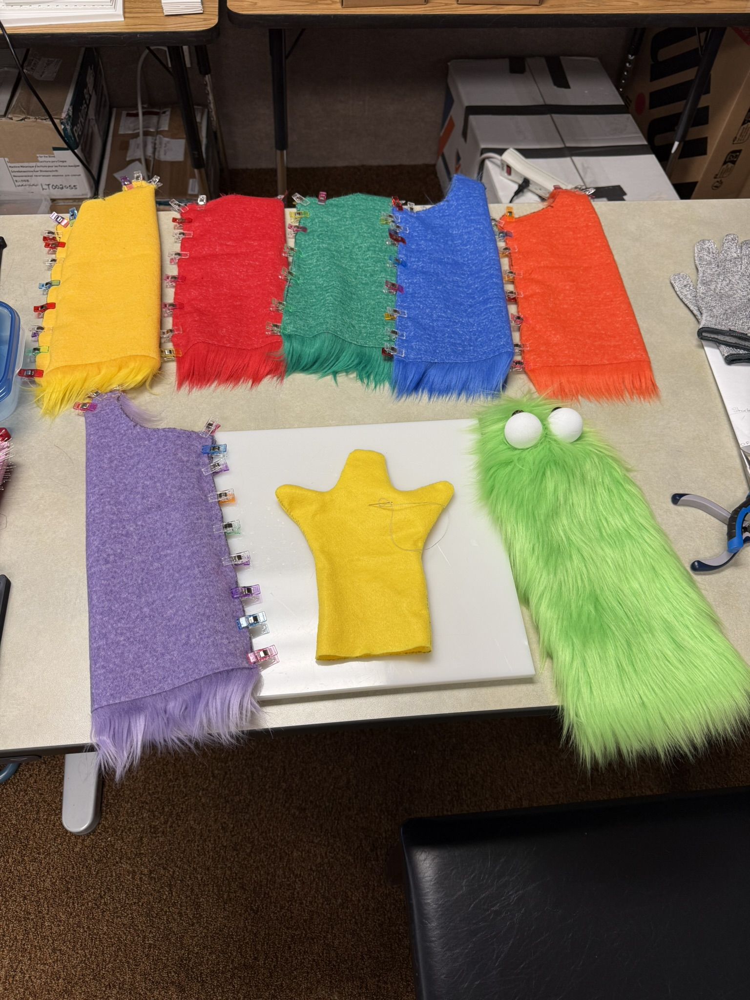
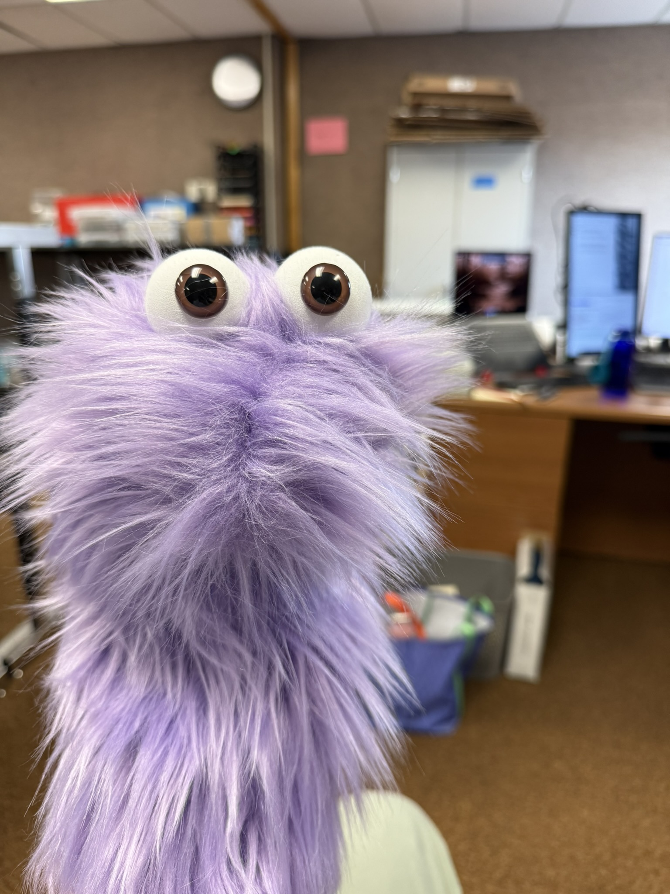
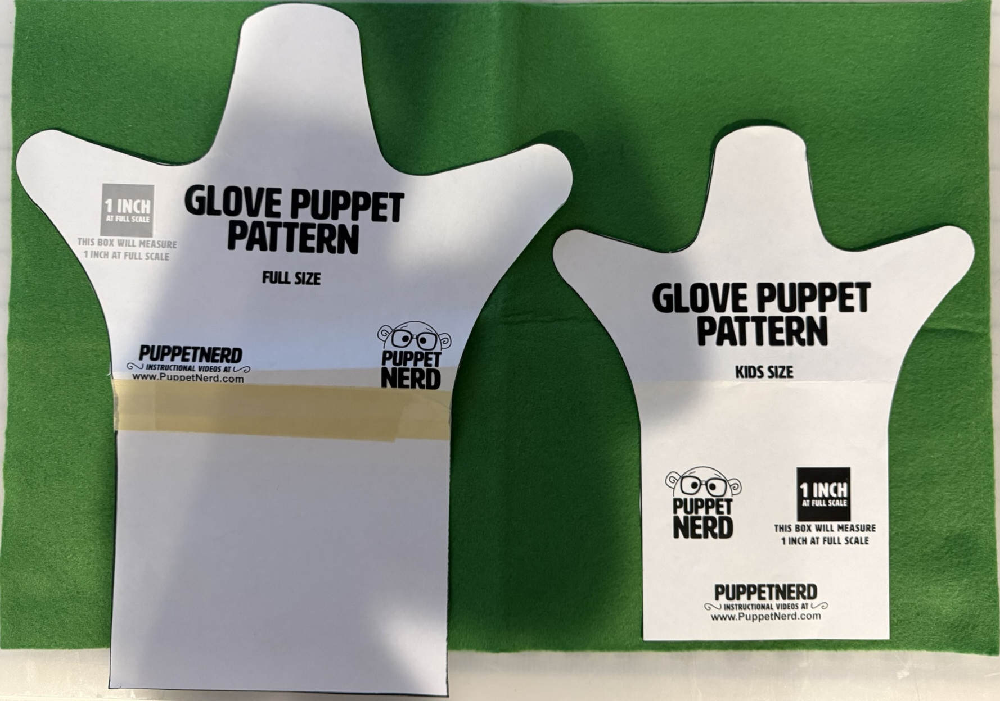

## Snoof Puppets
Here is the pattern from Puppet Nerd (I provide it here so you do not have to give a random website your email address): 
[Snoof Puppet Pattern](/assets/files/Make-a-Snoof-Kreutinger-Puppets.pdf)

### Materials:
- From Amazon: 
    - FabricLA Shaggy Faux Fur Square - 15" X 15"  Precut
    - ToLanbbt 8 Pcs Adhesive Foam Padding Sheets Closed Cell Neoprene Foam
    - 100 Pcs 3D Clear Safety Eyes
    - 60 Pcs Felt Sheets Fabric, 4" X 4" Soft Felt Sheets (Black)
    - 60 Pcs Felt Sheets Fabric, 4" X 4" Soft Felt Sheets (Red)
    - Geyoga 12 Pairs Women Triangle Bra Insert Removable Spoerts Bra Pads Inserts Women Repalcement Pad
    - Choose Whichever Colored 12-20mm Safety Eyes in Color of your choice.
- From Wawak
    - Coats and Clark polyester thread (500 yds)
    - Wawak Plastic Sewing Clips - Standard - 1" X 3/8" - 100 Pack
    - Sewing Needles, size 7 (or your preference)
- From PuppetPie.com
    40 mm EVA foam eyeballs 

### Instructions:

## Glove Puppets

Here is the pattern from Puppet Nerd (I provide it here so you do not have to give a random website your email address):
[Glove Puppet Patterns](/assets/files/Glove-Puppet-Pattern-Puppet-Nerd.pdf)

### Materials:
- From Amazon
    - XSEINO 6 Rolls 12" X 35" 1.4mm Thick Soft Felt Fabric Sheet 6 Assorted Classics Series Colors Felt Pack for DIY Craft Sewing SQuares Nonwoven Patchwork
    - Any Appropriately sized buttons for eyes
- From Wawak
    - Coats and Clark polyester thread (500 yds)
    - Wawak Plastic Sewing Clips - Standard - 1" X 3/8" - 100 Pack
    - Sewing Needles, size 7 (or your preference)

### Instructions:

